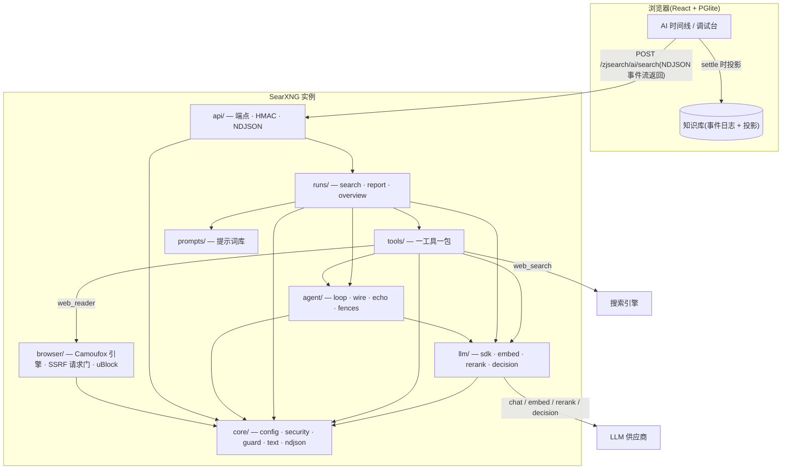
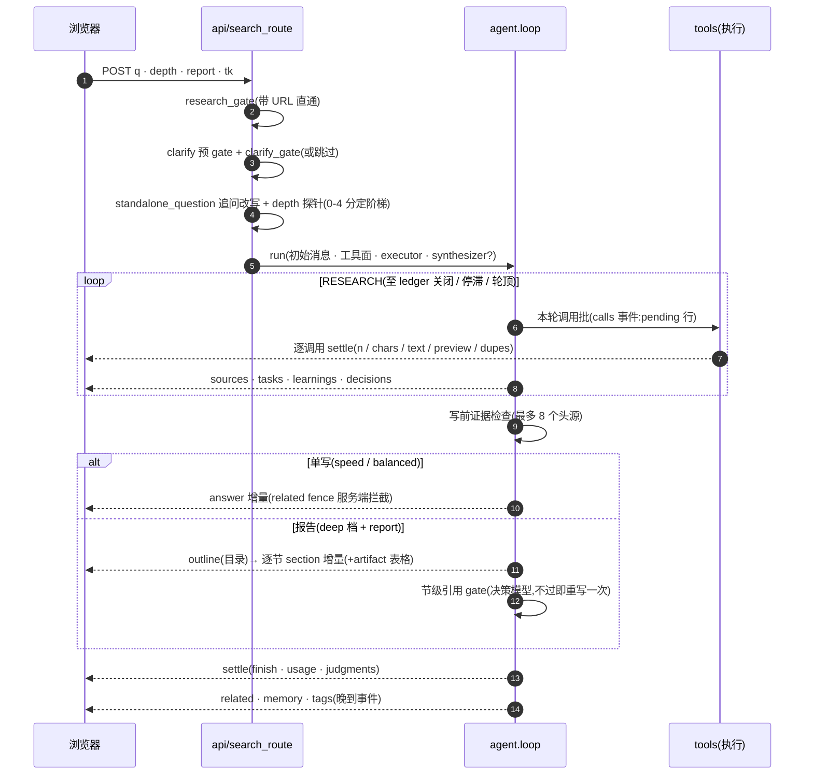
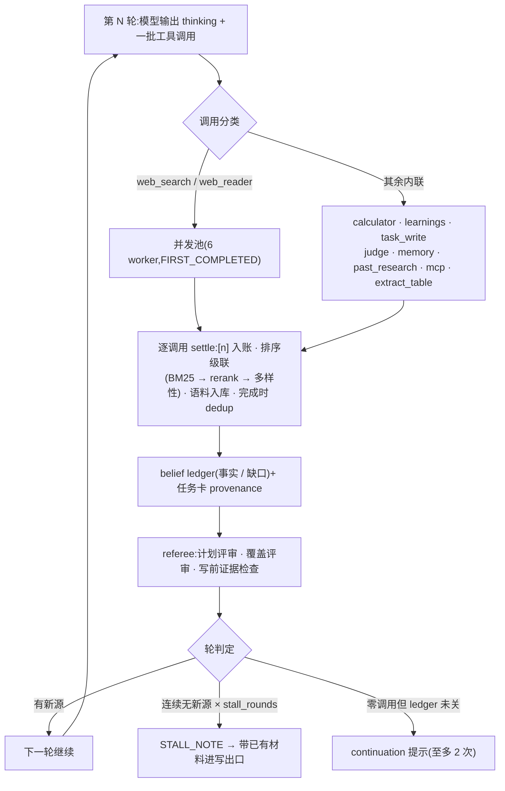
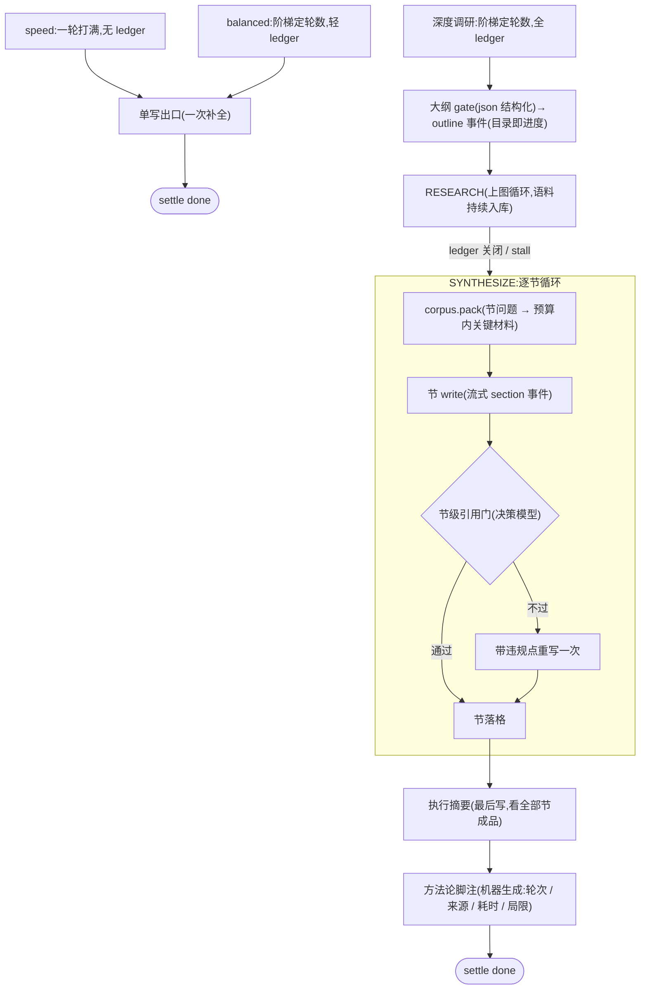
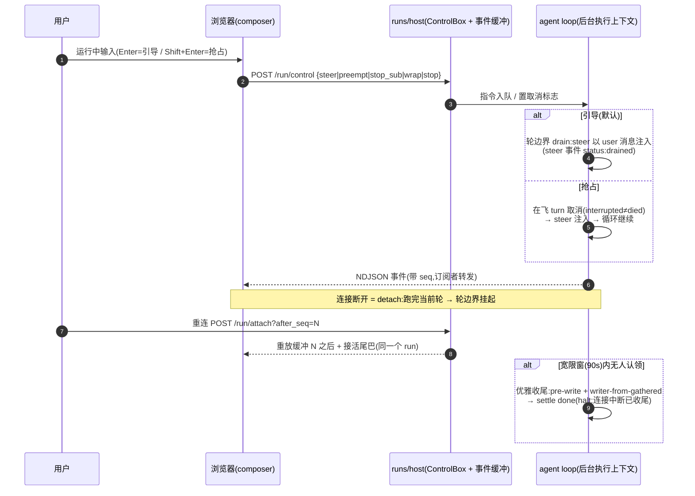

# ZJSearch 下一代(v2)设计:代码结构 × Agentic Harness

状态:v2 主体已实施(2026-10-07,见文末「实施状态」);v2.1 提案(§8:多代理 × 人在环路 × Run Host,draft,2026-10-08)。分支 `zjsearch`。
本文基于对当前代码的全量调研(所有结论带 file:line 证据),回答两个问题:

1. **代码结构重排**——后端从零设计文件结构(重点是解散 `capabilities/` 的模糊地带、拆解 `executor.py`/`route.py` 两个巨石),前端统一设计语言并把工具行渲染参数化;
2. **Agentic & Harness**——以两张样例报告(多肽原料药产业调研 / 深圳住宅市场价格矩阵)为验收基准,当前架构能否胜任、差距在哪、怎么补。

---

## 0. 结论(TL;DR)

**当前架构做得出"答案",做不出这两份"报告"。** 差距不在模型能力,在 harness 的五个硬限制:

| # | 硬限制 | 证据 |
|---|---|---|
| 1 | **答案 = 单次 write turn 的一坨 markdown**。无大纲、无分节、无逐节上下文装配 | `framework/loop.py:389-433`(全答案一次补全) |
| 2 | **deep 模式的输出 shape 是坏的**:`_DEPTH_SHAPE` 没有 `"deep"` 键, unreachable 的 `"quality"` 键("## 分节长文")才是报告形态——即 deep 一直在用 balanced 的 "Keep it moderate" 写长文 | `runtime/writer.py:21-36,136`、`runtime/profile.py:13`(模式只有 speed/balanced/deep) |
| 3 | **writer 上下文 40k 字符**(deep 96k),整块淘汰;researcher 转写只增不压缩;learnings 是 400 字符的散文事实,**没有表格/数据点这类结构化产物通道**——价格矩阵、产能对比表只能靠 writer 从 300 字符摘要里凭记忆重建 | `runtime/context.py:30-36`、`tools/learnings.py:19-24`、`runtime/feed.py:25-27` |
| 4 | **calculator / MCP 的结果永远进不了 writer 的上下文**(只进 researcher 对话),而 `<figures>` 规则又禁止 writer 无来源地给数字——推导表格在协议上不可能 | `runtime/executor.py:929-963`(MCP 分支无 `feed.append`)、`spine.py:129-141` |
| 5 | **write 调用没有服务端 max_tokens**(openai/gemini/dashscope 全靠部署方 params;Anthropic 默认 **4096**)——1-2 万字符的报告会直接被 `length` 截断 | `infra/caching.py:14-17,42` |

**代码结构**:后端 12,150 行里 `executor.py`(1,455 行,≥7 种职责)+ `route.py`(619 行,"thin by design" 但内嵌两段 LLM gate prompt)占掉 17%;同一功能散落 4 处(加一个工具要同步改 `tools/__init__.py`、executor if-chain、`rows.py` if-chain、route 装配);横切件(raw-args 守卫 ×8、config 样板 ×7、receipt 手拼 ×32、NDJSON ×2、SSRF ×2、相关性排序 ×2)全部存在 2-8 份手抄。前端 `AiSearchRunSection.tsx` 1,236 行,10 个工具行组件各自复刻 open/debug 状态机,metric 内容各写各的(两行空 metric 渲染孤儿分隔符、一行把原始查询串塞进数字槽),右侧栏 6 个 section 头手写 6 遍。

**方案骨架**(后文展开):

- **Harness v2 = REPORT 运行模型**:现有单循环保留为"浅模式";报告模式升级为三阶段 **PLAN(大纲先行)→ RESEARCH(现有 loop 增强)→ SYNTHESIZE(逐节撰写)**。新增 Run Corpus(运行内语料检索)、结构化产物通道(表格/数据点,单元格级引用)、逐节 write + 节级引用 gate、wire 协议增量(`outline`/`artifact`/`section` 事件)、客户端 Document 渲染器(TOC + 真表格)。
- **后端 v2 = Tool-as-Package + 薄 API 面**:`ai/` 内重组为 `core / llm / agent / prompts / tools / runs / api` 七个包;每个工具一个自包含包(spec+run+settle+row 语义),`capabilities/` 解体归位,executor/route 的 if-chain 与手拼 receipt 全部由注册表和底座取代。迁移用绞杀式(strangler)分五阶段,不做大爆炸重写。
- **前端 v2 = 一个 ToolRow 内核 + 每工具一个 settlement-view 声明**;Rail 统一 `RailSection`/`CapSection`;答案渲染升级为 Document 渲染器(无大纲时退回现有 MarkdownAnswer,完全向后兼容)。

---

## 1. 验收基准:两份报告的形态学

两张样例图是同一套报告语言,拆解出可验收的元素清单:

**结构元素**

1. 封面头:分类标签 + 主标题 + 副标题 + 元信息(日期 / 数据窗口);
2. Executive Summary:带标签的结论块(基线判断 / 核心逻辑),每条加粗、可带引用;
3. 编号章节(I / II / 1. / 2.),章节内再分小节;
4. **实体卡片**:公司卡(采购市场地位 / 研发与生产布局 / 供应链战略 / 客户与商业模式 / 财务与研发投入)、片区卡(价格锚点 / 成交价 / 挂牌价 / 数据来源)——本质是"结构化字段 + 粗体标签";
5. **数据表格**:公司/产能/投资/投产时间矩阵;项目/均价/户型/成交周期矩阵——**单元格带来源标注**;
6. 战略建议卡:Recommendation / Key Considerations / Suggested Actions / Risk Assessment 四字段;
7. 风险矩阵、Q&A 段;
8. **研究方法与数据说明**脚注(方法、局限、数据窗口)。

**量化基准**(从报告体量反推)

| 维度 | 量级 |
|---|---|
| 成品长度 | 10,000–25,000 字符(约 6k–15k output tokens) |
| 章节 | 6–12 个一级章节,每个 1–3k 字符 |
| 来源 | 40–150 个不同来源,[n] 引用 100–400 处 |
| 工具调用 | 60–200 次(搜索为主,web_reader 15–40 次,计算若干) |
| 表格 | 3–10 张,每张 5–20 行 |
| 耗时 | 10–30 分钟 wall clock |

当前最深档(deep,depth-probe 最高 rung 120 轮)在"调研量"上够得着,**在"产出"上完全够不着**——这是本方案的第二部分要解决的。

---

## 2. 现状体检(事实清单)

### 2.1 Harness:十个硬限制

1. **单次 write turn**:`loop.py:389-433` —— 答案由一次无工具的流式补全产出;`length` 截断只会记进 `settle.finish`,没有续写。
2. **deep shape 缺键**:`writer.py:21-36` 的 `_DEPTH_SHAPE` 键为 speed/balanced/**quality**;模式实际是 speed/balanced/**deep**(`profile.py:13`)→ deep 落到 balanced 的 "Keep it moderate";`writer.py:33` 的分节长文 shape 永远不可达。同族死键还有 `context.py:30-36` 的 `"goal": 96_000`(goal 模式已不存在)。
3. **prompt 与配置互相矛盾**:deep 的 researcher prompt 写 "up to 18 rounds, about 10 minutes"(`researcher.py:55` 附近),配置实际是 120 轮 / depth-ladder 最高 120(`route.py:216-256`、`infra/decision.py:116-117`)。
4. **writer 上下文 40k/96k 字符整块淘汰**(`context.py:30-72`):20-40 轮 deep run 的 feed 必然触顶;被淘汰的来源连引用号都带不走(淘汰通知要求"只引用剩下的")。
5. **researcher 转写零压缩**:`loop.py:325-338` 只增不减,web_reader 全文默认**无上限**进转写(`reader/config.py:92-103`);唯一缓解是 prefix caching(省钱不省延迟);24k 字符后的 `FEED_CONVERGE_NOTE` 是"劝模型别再搜",不是压缩。
6. **无结构化产物通道**:learnings 是 400 字符散文;没有表格/数据点/图表数据工具;MCP 结果 20k 字符只进对话不进 feed(`executor.py:929-963`);calculator 结果同样不进 feed。writer 建表只能凭 300 字符摘要 + 记忆,`<figures>` 又正确地禁止它无来源推导 → 数字密集的表格在协议上做不出来。
7. **无图表管线**:图片限于 ≤2 组 × ≤4 张搜索结果图(`writer.py:79-81`);markdown 图片被禁(`spine.py:109-112`);客户端唯一数据图组件 Stock.tsx 的绘图原语是模块私有的。
8. **并发上限 3**:`MAX_PARALLEL = 3`(`executor.py:64-70`),搜索/读页并发、其余工具串行;200 次调用 ≈ 67 个网络波次,墙钟时间失控。
9. **引用保障是提示词级的**:post-write 审计已删(`audit.py:12-15`,理由成立——"答案之后的裁决只能徽章不能修");pre-write evidence check 只覆盖 ≤8 个头源(`executor.py:1142-1210`)。对 40-150 源的报告,这个护栏面不够。
10. **coverage 的文案在撒谎**:模块 docstring 与给模型的 feed 文案仍承诺"a subtask with sources is marked done automatically"(`coverage.py:4-8`、`executor.py:672-676`),实现早已是 PROVENANCE ONLY(`coverage.py:56-61`)——模型被承诺一个不存在的自动化。

### 2.2 后端结构:十个热点

(全量 71 文件 12,150 行;runtime ≈ 5,700 / infra ≈ 3,240 / capabilities ≈ 1,686 / framework ≈ 815)

1. **`runtime/executor.py` 1,455 行** ≥7 职责:工具派发 if-chain(593-1047)、32 处手拼 receipt、四个内联决策 gate(各带 prompt 文本)、belief-ledger 状态机、排序级联编排、SystemOne 格式化。
2. **`runtime/route.py` 619 行**:"thin by design" 的视图函数内含 clarify 预 gate prompt(156-185)、深度探测 5 档评分 rubric(216-256)、工具面装配、[n] 预编号闭包、gallery 校验、187 行 `_Ndjson` 用量合并状态机(413-599)。
3. **~1,000+ 行 prompt 文本散在 Python**(`researcher.py`/`writer.py`/`gates.py` + 决策 gate 指令散落 executor ×4、route ×2、audit),无 prompt 注册表;`spine.py` 只覆盖共享契约。
4. **calculator 被劈成两半两层**:`tools/calculator.py`(spec/parser)+ `capabilities/calculator.py`(求值+settlement),后者**向上 import** runtime(`capabilities/calculator.py:23`)——唯一公开的层序违例。
5. **`capabilities/mcp.py` 310 行 7 种职责**:config、SDK 探测、会话生命周期、spec 生成、渐进披露策略、一个关键词搜索引擎(工具发现)、线程桥接;被三层同时 import。
6. **加一个工具要改 4 处**:`tools/__init__.py` 装配、`executor.execute` if-chain、`rows.display_item` if-chain(两条链手动同步)、`route.py:343-353` 工具面列表。
7. **横切件手抄**:raw-args JSON 守卫 ×8(`tools/args.py` 是正主,7 处绕开)、`settings.get("zjsearch", {})` + env-key 回退 ×7、`enabled/configured/sdk_missing/capability` 四件套 ×7、HMAC prologue ×4(`infra/http.authorize` 存在但 3 个路由手抄)、`_Ndjson`+`_UpstreamDead` ×2(route/overview)、SSRF 门 ×2(images/fetch,黑名单还不一致)、rerank→embed 相关性排序 ×2(`overview._ordered_context` vs `context._relevance_order`)、关键词评分器 ×4。
8. **零 Blueprint,12 个 `install(app)`**,9 个路由 + 1 个 before_request;启用门(gate/configured/sdk-missing)每个 install 各写一遍、措辞各异。
9. **用量记账 5 种形状**:loop `_Tally`、executor 的 rerank/decision 桶、route 的 gate_usage 折叠,decision-token 折叠舞蹈在 executor 重复 4 次。
10. **`stream.py` 429 行**重实现搜索页渲染路径(自有 `_render_context`),feed.py/page.py/knowledge_page.py 三处 lazy `from searx import webapp` 带 cyclic-import 压制。

### 2.3 前端:十个不一致

(aiSearch/ 共 4,388 行;`AiSearchRunSection.tsx` 1,236 行;markdown 渲染 = react-markdown + GFM + mermaid + KaTeX,**表格已支持**)

1. **metric 内容各行其是**:AskRow/MemoryRow 成功态 metric 返回 `""` 但 shell 无条件追加 `· formatMs(ms)` → 孤儿分隔符(`AskRow.tsx:36`、`MemoryRow.tsx:41`、`rowBase.tsx:103-113`,已亲自复核);TaskRow 把原始查询串塞进 mono 数字槽;JudgeRow 塞原始裁决串;McpRow 固定"完成"不带计数。
2. **debug 组成 7-vs-3 分叉**:TaskRow/LearningsRow/AskRow 只挂 DebugArgs 且只看 `rawArgs !== null`——这三类工具带 feed 的调用**在界面上没有任何 receipt 可看**;其余 7 行是 args+feed。
3. **CalcRow 破行法**:唯一无 chevron、结果常显在 Collapse 之外的行(设计上可接受,但未写成规范)。
4. **DecisionsCard 手写第二套行语言并整块复制两遍**(:242-281 与 :289-328),不走 CallRowShell:无 `text-[11px]`、无 middot、`ms` 为空时隐藏。
5. **一页两套时长格式**:行内 `formatMs`;run 头部 ElapsedTimer 手拼秒/分字符串(`AiSearchRunSection.tsx:554-574`);另有 `toFixed(2)` vs 共享 `formatScore`(`toFixed(1)`)两种分数格式。
6. **READ_PANE 机器底衬手抄三次**且互有漂移(DebugArgs 无 font-mono、DebugFeed 有、ThinkScroll 用 px-3);HOVER_CHIP 复制时丢了 backdrop-blur 和 group-focus-within。
7. **6 个 rail section 头手写 6 遍**,其中 Sources 一处类名漂移(`flex shrink-0 flex-wrap`)。
8. **cap-and-expand 三种体制 + 一个没有**:sources/findings/gaps 父控布尔、DecisionsCard 自持 useCapExpand(→ citation-locate 链打不开它)、AskArchiveCard 硬丢旧条目无展开。
9. **CapChip 类名复制 4 份**,margin 漂移(mt-2 vs mt-1.5)。
10. **展开体节奏漂移**:TaskRow/LearningsRow/AskRow/DecisionsCard 四个同形列表四种 px/py/行距,文本管线两种(裸 span vs Snippet+escapeHtml)。

前端已有的正确地基(保留):`rowBase.tsx` 的共享行壳与右侧 mono cluster、`formatMs` 的分层格式、GFM 表格渲染、引用 chip 链、`useCapExpand`+`CapChip`、审计离线闭环(`pnpm run audit` + ai-mock)。

---

## 3. Harness v2:REPORT 运行模型

设计立场:**报告是一个 output 契约,不是第四种 agent**。现有单循环一字不动地继续服务 speed/balanced;报告是 deep 之上的"产出形态"升级(`report` 形态),复用全部既有机制(task ledger、stall 策略、registry、rank、clarify、事件溯源)。

### 3.1 三阶段总览

```
PLAN        RESEARCH                         SYNTHESIZE
─────       ────────                         ──────────
大纲 gate →  现有 loop(增强:                 逐节 write(每节一次补全)
(report     · corpus 持续入库                 · 节上下文 = 大纲+findings
meta+       · extract/表格产物工具              +该节 packed corpus+artifacts
sections)   · compaction(转写折叠)            +相邻节摘要)
  ↓         · researcher 可修订大纲            · 节级引用 gate(交付前)
task ledger ←                                 · settle 前方法论文本自动生成
```

浅模式(单写)与报告模式在 wire 上的差别:报告模式多发 `outline` / `artifact` / `section` 事件,`answer` 缓冲被 `sections[]` 取代;客户端按 **有无 outline 事件** 选渲染器——旧服务器/旧客户端互相兼容。

### 3.2 大纲:task_write 的结构化超集

不新增孤立工具——把 `task_write` 的 `items[{title,status}]` 升维为 `sections[{title, brief, key_questions[], artifact_needs[]}]`:

- **初始化**:clarify(若有)解决方向后,一个 json_completion gate 从 `question + clarified + depth-rung` 生成 4-10 节的大纲骨架(含报告 meta:标题/副标题/数据窗口)——模型写,不免费瞎猜;
- **Living list**:RESEARCH 阶段 researcher 照旧用 `task_write` 增量修订(它是既有的 living task list 机制,coverage 匹配逻辑原样沿用);允许增删节、改 brief;
- **双重身份**:大纲既是 researcher 的作业清单(coverage/ledger 关闭条件),也是 writer 的写作骨架,也是客户端的目录/进度面(每节状态:调研中 → 撰写中 → 完成);
- **验收钩子**:每节 `artifact_needs[]`(如 `table:capacity`, `table:price-matrix`)声明该节需要的产物,SYNTHESIZE 前校验——产物缺失的节要么降级为"定性论述",要么在成稿中显式标注证据缺口。

### 3.3 Run Corpus:运行内语料检索(逐节上下文装配的地基)

现状的根本矛盾:writer 要写 8 节,但 40k 字符装不下 100 个来源;`<findings>` 是散文,撑不起表格。解法是把"运行"本身变成可检索语料:

- **入库**(RESEARCH 期间持续):每个 web_search 的全量结果(30 条/次,feed 只展示 5+5)、web_reader 全文(现归档进 knowledge 的同一份)、learnings 事实、calculator 结果、extract 表格行;
- **索引**:内存 BM25(复用 `bm25_reranker` 的 CJK tokenizer)起步;`zjsearch.embedding` 开启时加向量通道——直接把 `overview._ordered_context` 与 `context._relevance_order` 这对重复实现合并成唯一的 `corpus.order()`;
- **消费**:每节 write 前 `corpus.pack(section, budget)` —— 该节 key_questions + brief 作查询,取 top-k 块(块 = 来源段/事实/表格行),按节预算(6-10k 字符)打包;**相邻节只带标题+一句话摘要**,防重复;
- **附带收益**:follow-up 问答可以первый从 run corpus 作答(现在 follow-up 只有 4 轮 2k 字符历史);断点继续(continue)后新 run 可继承语料索引的持久化部分。

### 3.4 结构化产物:`extract_table` 工具 + Artifacts 通道

这是让"表格带单元格引用"成为可能的核心新增:

- 工具 `extract_table`(researcher 调用):`{title, columns[], rows: [{cells[], refs: [n]}]}` —— researcher 在阅读中把分散数据固化成表,**单元格级 [n] 绑定**;校验 refs 必须已在 registry(与 gallery 白名单同一信任模型);
- 产物在 wire 上以 `artifact` 事件给客户端(replace-per-id,同 `tasks` 的快照语义);SYNTHESIZE 时以"已验证数据"身份进入对应节的上下文,writer 的职责从"重建表"降为"引用并解说表"——与 `<figures>` 诚实规则完全自洽(数字来自被引用的输入,推导留给 calculator 并要求写明推导);
- `record_datum`(轻量单点:数值 + refs + 语境一句话)作为表的补充,喂给执行摘要与对比句;
- 客户端:`ArtifactTable` 真表格组件(单元格引用 chip 可点击定位 rail 来源),样式沿用 `AiSummary` 现有 GFM 表格语言。

### 3.5 分节撰写协议(SYNTHESIZE)

- 每节**一次独立 write call**(顺序执行;节间无依赖的以后可并行):
  上下文 = 全局 spine(答案契约/引用规则/figures)+ 大纲全文 + 全部 findings(压缩态)+ 本节 `corpus.pack()` + 本节 artifacts + 前节末尾 200 字符摘要;
  输出 = 本节 markdown(1-3k 字符),流式走 `section` 事件(增量 append 到该节缓冲,客户端实时渲染该节);
- **节级引用 gate(交付前)**:每节交付时对"本节 [n] 所指来源是否支撑对应句子"做一次抽查式校验(判断模型,复用 decision 面或 json gate;每节抽 3-5 处)。失败 → **该节立即重写一次**(带上违规点),而不是徽章。这是 post-write 审计被删除时给出的理由("答案之后只能徽章")在结构上的修复:审计挪进了节间,答案还未最终交付;
- `related`/gallery 契约只在**最后一节**尾部生效(follow-ups fence 不变);
- **执行摘要节**最后写(它综述全文,必须看到全部节成品);方法论脚注由**机器生成**(轮次/来源数/调用数/模型/耗时/数据窗口),不劳模型。

### 3.6 上下文工程:转写折叠(compaction)

- 触发:累计 feed 字符越过阈值(现 24k 的 `FEED_CONVERGE_NOTE` 位置)或轮次 > N;
- 动作:把最旧 K 轮的 tool 结果消息折叠为一条机械摘要消息(保留:每轮的 learnings 增量、查询列表、命中计数;丢弃:原始 feed 文本——反正已入 corpus);
- **前缀缓存友好**:折叠点对齐到 K 的倍数轮,两次折叠之间前缀字节稳定(折叠是低频跳变,不是每轮扰动);
- learnings/task/registry 是持久账本,永不折叠。

### 3.7 执行预算

- `MAX_PARALLEL` 3 → **6**(配置化 `zjsearch.feature.ai_search.max_parallel`);
- write max_tokens **服务端显式化**:speed 2k / balanced 4k / deep 6k / report 每节 4k(部署可 `zjsearch.ai.params.max_tokens` 覆盖;Anthropic 的 4096 隐式默认随之消亡);
- 节级超时与整 run 墙钟护栏(goal 的 `max_seconds` 机制沿用,报告档默认 0 = 不限,可配);
- 深度探测 ladder 不变(deep 最高 120 轮),报告模式在 rung ≥ 3 时才开放(12+ 轮的题不值得报告形态)。

### 3.8 Wire 协议增量(闭集扩充,向后兼容)

| 事件 | 载荷 | 语义 |
|---|---|---|
| `outline` | `{title, subtitle, window?, sections: [{id, title, brief?, status}]}` | 快照 replace(同 `tasks`);客户端目录 + 进度 |
| `artifact` | `{id, kind: "table", title, columns, rows, refs}` | 快照 replace per id;单元格 [n] 绑定 |
| `section` | `{id, delta}` | 该节 markdown 增量;`settle` 前 sections 全部落位 |

浅模式不发这三个事件;客户端以"收到过 `outline` 与否"切换 Answer 渲染。`settle` 语义不变;late set(related/memory/tags/usage)不变。

### 3.9 客户端:Document 渲染

- 有 outline:`DocumentView` = 封面头(meta)+ 粘性 TOC(章节锚点,`scrollIntoViewAnimated` 既有链)+ 逐节 `MarkdownAnswer` 复用(节内渲染器就是现有 markdown 管线:GFM 表格/mermaid/KaTeX/引用 chip 全部继承)+ `ArtifactTable` 替换对应占位;
- 无 outline:现有 `MarkdownAnswer` 原样(单写模式);
- 执行摘要、建议卡、风险矩阵 = markdown 结构(粗体字段标签),不新增协议;
- 图表(chart)列 P2:先提升 `Stock.tsx` 的 `makeScale`/`SegmentLine`/`RangeLine` 为 `lib/chart.tsx` 公共原语,`artifact kind:"chart"` 后续接入;v1 报告以表格为主(两张样例亦是)。

### 3.10 质量与诚实

- 引用密度:每节 prompt 要求"每个实质断言带 [n];无来源支撑的断言要么删要么明确标注证据缺口"——与 spine 的 grounding 规则同源;
- 矛盾检测:`audit.finding_conflict`(embed 近邻 + noul)从"ledger 记录时"扩展到"节撰写前对本节引用集复查";
- 方法论脚注:机器生成,含局限陈述(数据窗口内、引擎覆盖范围)——样例报告的"研究方法与数据说明"是诚信特性,不是装饰;
- 修复 §2.1-10 的文案谎言(coverage 自动标 done)。

---

## 4. 后端结构 v2(from zero)

### 4.1 目标目录树

原则:依赖严格向下 `api → runs → tools → agent → llm → core`;**tools 与 runs 都不允许 import api**;prompts 独立成包(它是被 runs/tools 消费的素材,不是逻辑)。

```
searx/zjsearch/
  __init__.py                 # install(app) 链(保持)
  stream.py                   # 渲染/流式搜索页(保持,内聚已可)
  pwa.py                      # 保持
  ai/
    __init__.py               # 装配:遍历 api/routes 注册
    core/                     # 【新】横切底座,零 AI 语义
      config.py               #   settings 读取 + env-key 回退(归一 7 处)
      security.py             #   HMAC(自 infra/security 迁入)
      usage.py                #   Usage dataclass + fold(归一 5 种记账形状)
      ndjson.py               #   Ndjson 流包装(归一 route/overview 两份)
      text.py                 #   raw_args/json 守卫、截断、keyword scorer(归一 8+4 处)
      guard.py                #   SSRF 门(归一 images/fetch 两套黑名单)
      clock.py                #   超时常量集中 + ms 计时器
    llm/                      # 【= infra 改名】供应商层
      sdk/  caching.py  jsongate.py  streaming.py
      embed.py  rerank.py  decision.py  http.py
    agent/                    # 【= framework 改名】引擎层
      loop.py  wire.py  executor.py(仅契约)  echo.py  thinkgate.py  fences.py
    prompts/                  # 【新】prompt 注册表:文本离开业务文件
      spine.py  researcher.py  writer.py  gates.py  referee.py  extractor.py
      (每个块 = 常量 + 变量注入函数;语言指令唯一出口)
    tools/                    # 【核心重组】一工具一包,自包含
      base.py                 #   Tool 协议 + ToolContext + Receipt builder(归一 32 处手拼)
      registry.py             #   TOOLS: {name: Tool};派发、spec 汇总、row 语义
      web_search/  web_reader/  calculator/  learnings/  tasks/
      ask_user/  memory/  past_research/  judge/  mcp/
      extract/                #   【新】表格/数据点产物工具(§3.4)
      (每包:spec.py 模式+描述 | run.py 执行 | settle.py receipt+feed 贡献)
      web_reader/ = reader.py(spec+knobs+guard+TTL 缓存,一文件全工具)+ extract.py(底层,共享错误类型);渲染引擎另立 ai/browser/(Camoufox 反检测 Firefox + uBlock Origin,Browserless 已移除)
    runs/                     # 【= runtime 业务核心】具体任务
      profile.py              #   模式/预算(修死键)
      search/
        gather.py             #   搜索执行+settle(自 executor 解体)
        ledger.py             #   belief ledger + coverage
        referee.py            #   plan_review / coverage_referee / evidence_check / read_gate
        rank.py  registry.py  feed.py  coverage.py
        context.py            #   writer 上下文预算(与 corpus 合并 §3.3)
        corpus.py             #   【新】Run Corpus(§3.3)
        task.py               #   run 装配(原 route._search 的业务件)
      report/                 #   【新】报告运行(§3)
        outline.py  sections.py  synth.py  artifacts.py  method_note.py
      overview.py  thread.py
    api/                      # 【= 路由集中地】HTTP 面,薄
      authorize.py            #   统一 HMAC prologue(归一 4 处)
      routes.py               #   9 个端点的视图,只做:解析→调 runs→包流
      install.py              #   唯一 add_url_rule 处(或保留 per-module install,但门走 authorize)
```

改名说明:`infra→llm`、`framework→agent`、`runtime→runs` 是**可选的纯重命名**,放迁移最后一拍;先到位的是内容划界(下面 §4.6)。

### 4.2 Tool-as-Package 契约

```python
class Tool(Protocol):
    name: str
    def spec(self, ctx: RunContext) -> ToolSpec          # JSON schema + description
    def run(self, ctx: RunContext, args: dict) -> ToolOutcome   # 执行(async 友好)
    def settle(self, outcome: ToolOutcome) -> Receipt     # wire "call" 事件字段
    def feed(self, outcome: ToolOutcome) -> str | None    # 对 writer/corpus 的贡献
```

- `registry.TOOLS` 是唯一派发表:executor 的 if-chain 与 `rows.display_item` 的 if-chain 同时消亡;**新增工具 = 一个包 + 一行注册**(现在要动 4 处);
- `Receipt` 由 base 的 builder 统一构造(status/n/ms/feed[:800]/...),32 处手拼消失;
- 工具包内部自由(web_reader 保持 fetch/extract/config 三模块),对外只有契约;
- `run()` 的并发语义在包上声明:`parallel=True`(search/reader/mcp)进线程池,`inline`(计算/记账类)当场执行——现在"哪些能并行"是 executor 里的隐式知识。

### 4.3 现文件 → 新位置映射(capabilities 解体表)

| 现位置 | 新位置 | 备注 |
|---|---|---|
| `runtime/tools/{web_search,web_reader,learnings,tasks,ask_user,judge,memory,past_research,calculator}.py`(spec/parser) | `tools/<name>/spec.py` | 与实现合体 |
| `runtime/executor.py` 派发分支 | `tools/registry.py` | if-chain → dict |
| `runtime/tools/rows.py` | 删除(前端 settlement-view 取代;后端仅在 Receipt 里带 label/metric 语义字段) | |
| `capabilities/calculator.py` | `tools/calculator/`(eval+settle 并入) | 消灭上向 import |
| `capabilities/reader/*` | `tools/web_reader/`(后收拢为 reader.py + extract.py;Browserless 移除,渲染由 ai/browser/ 引擎承担) | 迁后二次收拢 |
| `capabilities/mcp.py` | `tools/mcp/`(拆 config/connection/spec/discovery 四模块) | |
| `capabilities/user_memory.py` | `tools/memory/` | |
| `capabilities/past_research.py` | `tools/past_research/` | |
| `capabilities/images.py` | `runs/attachments.py`(overview 专属多模态附件) | SSRF 门换 `core/guard` |
| `runtime/{researcher,writer,spine,gates}.py` 的 prompt 文本 | `prompts/` | 业务文件只留装配函数 |
| `runtime/route.py` 的 gate/prompt/装配 | `runs/search/{task,referee}.py` + `prompts/` | route 只剩 HTTP |
| `runtime/executor.py` 的搜索执行/ledger/referee | `runs/search/{gather,ledger,referee}.py` | executor 本体瘦回 <300 行的 orchestration |
| `route._Ndjson` + `overview._Ndjson` | `core/ndjson.py` | |
| `overview._ordered_context` + `context._relevance_order` | `runs/corpus.py` 唯一实现 | |

### 4.4 依赖规则与守护

- 一条 nose2 单测(`tests/unit/test_zjsearch_layers.py`,后端测试是上游既有设施,不违反"client 无测试"政策):静态扫描 `ai/` 的 import 边,断言无向上/跨包违例,并列出白名单(searx 核心的 3 处 lazy webapp);
- pylint 照旧两把尺;`raw_args`/receipt/usage 之类归一后,新增重复会被 review 直接看见(文件数少了)。

### 4.5 迁移路径(为什么不是大爆炸)

zjsearch 分支持续在发功能,大爆炸重写必然长期双头。绞杀式五阶段,每阶段独立可发布、lint + AI-mock 审计通过:

- **M1 底座**:建 `core/`(ndjson/usage/text/guard/config/security),调用点逐个切换。行为零变化。
- **M2 工具包化**:逐工具迁移(每个工具一个 commit:spec+run+settle 合体、registry 注册、删 if-chain 分支)。calculator 先行(消灭层序违例),mcp 最后。
- **M3 route 瘦身**:gate/装配逻辑迁 `runs/search/`,`api/` 面收口;`prompts/` 建。
- **M4 executor 解体**:gather/ledger/referee/corpus 拆分;context 归一。
- **M5 改名拍**(可选):infra→llm、framework→agent、runtime→runs。

---

## 5. 前端结构 v2

### 5.1 ToolRow 内核 + settlement-view 注册表

把 10 个行组件的公共骨架(open/debug 状态机、shell、Collapse 编排)收进唯一内核,每工具只剩一个**声明式 view**:

```
features/results/aiSearch/tools/
  types.ts        # ToolView 契约:
                  #   label(call): string
                  #   metric(call, phase): MetricSpec   // {kind:"count"|"chars"|"value"|"text", text}
                  #   expandable(call): boolean         // 默认 true
                  #   Content?: (call) => ReactNode     // 展开体
                  #   Debug?: "full" | "args"           // 默认 "full"(消灭 7-vs-3 分叉)
  ToolRow.tsx     # 唯一内核:状态机 + CallRowShell + Collapse 编排
                  # 内核规则:metric.text 为空 ⇒ 不渲染 middot(修复孤儿 ·)
  registry.ts     # TOOL_VIEWS: Record<ToolName, ToolView>;未知工具 → webSearch 兜底(现状保持)
  views/
    webSearch.tsx  webReader.tsx  calculator.tsx  learnings.tsx  tasks.tsx
    askUser.tsx    judge.tsx      memory.tsx     pastResearch.tsx  mcp.tsx
```

- 与后端 `Tool.name` 注册表镜像(同 macros.html↔types.ts 的同步契约模式):后端新增工具,前端没写 view 时兜底行 + args/receipt debug 仍可用(不再静默破相);
- Debug 统一:所有可调工具行都有 args + receipt 两个 pane,失败 receipt 渲染为 Error pane(现有语义保留);calculator 是**成文特例**:无 chevron、结果常显——写进规范而不是留在代码里靠读;
- DecisionsCard 的行并入 CallRowShell 视觉(11px mono + middot + metric 槽),删除复制两遍的手写块。

### 5.2 Metric / Timing 规范(一份表格管所有行)

| 工具 | pending | ok | 说明 |
|---|---|---|---|
| web_search | 检索中… | `{n} 条结果` / 无结果 | n=0 显式"无结果",不显示 "0 条" |
| web_reader | 读取中… | `{chars} 字`(12.3k 缩写) | |
| calculator | 计算中… | `= {result}` | 特例:无 chevron |
| task_write | 生成中… | `{done}/{total}` | 替换现在的原始查询串 |
| learnings | 记录中… | `{n} 条事实` | |
| ask_user | 等待输入… | 回答摘要 ≤1 行 | |
| judge | 判断中… | `{choice} · {score}`(formatScore) | |
| user_memory | 保存中… | `{n} 条记忆` / `已保存` | 空 metric ⇒ 无分隔符 |
| past_research | 检索中… | `{n} 条命中` | |
| mcp_* | 执行中… | 完成描述(有计数带计数) | |

通用规则:全部 `font-mono text-[11px] tabular-nums`(共享 cluster 已是,规范成文);时长一律 `formatMs`;run 级时长 ElapsedTimer 改用 `formatDuration`(与 formatMs 同族,消除第二套词汇);分数一律 `formatScore`。

### 5.3 Rail 统一:`RailSection` + `CapSection`

```
rail/
  RailSection.tsx   # 唯一 section chrome(icon + title + count;6 处手写归一)
  CapSection.tsx    # = RailSection + useCapExpand + CapChip + forwardRef(forceExpand)
                    # citation-locate 从此能打开任意节(修复 DecisionsCard 不可达)
  TaskCard / FindingsCard / GapsCard / SourcesCard / DecisionsCard / AskArchiveCard
```

- 所有 cap 节统一 `useCapExpand` 单一体制(cap 4,父控/受控混合消除);AskArchiveCard 硬丢旧条目改为标准 cap+expand;
- `CapChip` 类名只存在于 CapSection 一处。

### 5.4 Answer / Document 渲染器

- `MarkdownAnswer`(AiSummary)保持为**节内渲染器**;新增 `report/DocumentView.tsx`:封面头 + TOC(锚点滚动走 `motion.ts`)+ 逐节渲染 + `ArtifactTable`;
- knowledge 页那份重复的 markdown table override 收编为共享 `lib/markdownParts.tsx`;
- `AiSearchRunSection.tsx`(1,236 行)拆为:`AnswerPane` / `RunRail` / `AskGate` / `Composer` / `ElapsedTimer` 五块,页面文件回到组装层(对齐"pages 薄、features 厚"的家规)。

### 5.5 目标目录树

```
features/results/aiSearch/
  timeline.ts  useAiSearch.ts(depth.ts / ledger.ts 保持)
  runs/AiSearchRunSection.tsx(拆后)
  tools/(§5.1)  rail/(§5.3)  report/(§5.4)
  calls/rowBase.tsx(内核吸收后仅留 CallResults/CallContent 等内容件)
```

---

## 6. 路线图

| 里程碑 | 内容 | 验收 |
|---|---|---|
| **M0 止血**(可立即做,不等重构) | ① `_DEPTH_SHAPE` 补 `deep` 键(真分节长文 shape)+ 清死键(quality/goal);② deep prompt 的 "18 rounds" 与配置对齐;③ 行内核空 metric 不渲染 middot;④ coverage 文案改诚实(PROVENANCE ONLY);⑤ ElapsedTimer/DecisionsCard 数字格式统一 | lint + 审计通过;deep 模式产出明显变长变结构化 |
| **M1 Harness spike** | report 形态最小闭环:outline gate + Run Corpus(BM25 起步)+ extract_table + 3 节 SYNTHESIZE + `outline/artifact/section` wire + 客户端 DocumentView 雏形 | 用两份样例报告的原题重跑,人工对比:结构齐、表格有单元格引用、长度 ≥8k 字符 |
| **M2 前端统一** | ToolRow 内核 + views + RailSection/CapSection + RunSection 拆分 | 审计页无回归;新增工具只写一个 view 文件 |
| **M3 后端 M1+M2 阶段**(core/ + 工具包化) | 见 §4.5 | 分层测试绿;两把 pylint 绿;行为零变化 |
| **M4 Harness 完全体** | 节级引用 gate + compaction + 并发 6 + max_tokens 显式化 + 方法论脚注 + 断点续写覆盖 report 模式 | 120 轮级长跑稳定;引用抽查失败自动重写生效 |
| **M5 后端 M3+M4 阶段**(route 瘦身 + executor 解体 + 可选改名) | 见 §4.5 | 全量审计 fixtures 覆盖 report 模式(ai-mock 扩充) |

依赖关系:M1 不依赖后端重构(在现有文件里先长出 report/,证明价值);结构迁移(M3/M5)随时可以插入而不与 harness 冲突——这正是绞杀式的意义。

---

## 7. 风险与未决问题

1. **成本**:报告模式一次 run 输出 30-60k tokens(逐节 write 比单写贵)+ 更长的 RESEARCH。缓解:prefix caching 已按 dialect 设计;节级 write 共享字节稳定前缀;报告档显式标注为 deep+ 消耗级。
2. **节间连贯**:逐节撰写可能松散。缓解:大纲 brief + 相邻节摘要 + 全局 findings 三层黏合;执行摘要最后写兜底全文口径;不满意时保留"单写模式"作为 fallback 形态(同一 harness,不同 output shape)。
3. **小模型大纲质量**:大纲烂则全文烂。缓解:outline gate 带结构校验(节数/字段);质量差可由 clarify 轮人工纠偏;未来可加"大纲修订"人机环节。
4. **corpus 一致性**:BM25 内存索引在进程内,断点继续后跨 run 复用要靠 knowledge 的 document 归档重建索引(v1 先做 run 内,跨 run 留待 v2.1)。
5. **重构窗口**:M3-M5 期间分支功能冻结策略需要约定(或严格按工具粒度小步走,保持每步可发版)。
6. **未决**:① 节级引用 gate 用 decision 模型还是 json gate(成本/准确权衡);② `section` 事件是否携带每节独立 settle(供 TOC 打勾)——倾向是;③ 图表(P2)的最小 kind 集(先 line/bar,数据来自 artifact);④ follow-up 是否升级为"report 内追问"(corpus 作答,不重跑研究)——倾向是,零新增协议。

---

## 8. v2.1 提案:多代理 × 人在环路 × Run Host

> 增补于 2026-10-08,基于:Anthropic《How we built our multi-agent research system》的外部参照、ZCode(引导/steering 与子代理中止)的机制调研、以及与现有 harness 的逐件对照。三个主题共享同一块地基——**活流注册表(run host)**:复杂问题的扩展(子代理)、执行中的人工干预(引导/打断/收尾)、断开后的恢复(reattach)都挂在它上面。

### 8.0 结论(TL;DR)

| 主题 | 一句话结论 |
|---|---|
| 多代理 | LeadResearcher 的骨架已在(task_write / ledger / coverage / registry / depth 探针),唯一真 delta 是"独立上下文的子代理";挂在 deep/report 档 + depth rung 门后,**不做默认路径** |
| 干预 | 栈里第二条 client→server 活通道(`run/control`)+ 五个动作;引导只在轮边界注入,**永不静默打断在飞流** |
| Run host | run 的命与客户端连接解耦:断开 = detach,重连 = reattach **同一个 run**;宽限超时优雅收尾;2h stale sweep 对这一类退役 |
| 追问 vs 引导 | 同一 composer,投递语义 = f(run 状态) 的纯函数;运行中只有引导,追问等 settle |

### 8.1 多代理:LeadResearcher + Subagents

**外部参照**(Anthropic,2025-06):orchestrator-worker;子代理的价值 = 压缩(各自的上下文烧完只回传要点)+ 并行上下文容量 + 关注点分离;token 用量单因素解释 80% 的效果方差,多代理 ~15× 于对话的成本;失败模式全是委派问题(模糊指令 → 重复劳动、无节制派工)。可迁移的教训:教 orchestrator 委派(目标 / 产出格式 / 工具指引 / 边界四件套)、按复杂度配 effort、先宽后窄、并行工具调用。

**现状对照**——LeadResearcher 的骨架已经全部在:

| Anthropic 部件 | zjsearch 现状 |
|---|---|
| 规划 + save plan | `task_write` 任务卡(coverage referee 用真实来源校验,比"模型自标 done"硬) |
| 子代理并行搜索、压缩回传 | **无——唯一真 delta** |
| 迭代评估(think/evaluate) | continuation 契约 + stall 检测 + belief ledger |
| CitationAgent 后置标注 | **不引回**:pre-write evidence check + 全局 [n] 是前置门(post-write 审计被删的同一理由:settle 后的裁决只能徽章不能修) |
| Memory(防上下文截断) | researcher/writer 分离 + 知识库 recall 已覆盖 |
| effort 分级 | depth 探针 + 三档阶梯 |
| 并行工具调用 | gather 池(6 worker,FIRST_COMPLETED) |

**两个前置回答**(重新引入子代理前必须回答——`spawn_subtask` 曾被移除,任务卡成为唯一分解面):

1. 旧 spawn_subtask 嵌套是旧协议时代的产物;wire v2(entry-stamped 闭集 + dumb renderer)、共享 dedup registry、coverage referee 都是当时不存在的承载面。此次回归是新地基上的旧思想,不是翻案。
2. 委派质量是模型能力的倍增器,而本栈处处按小模型设计 → 子代理**不做默认路径**:仅 deep/report 工具面注册、depth rung ≥ 阈值(缺省 3,可配)才开放;15× 的 token 经济由"高价值复杂问题"场景自行把关——这正是 Anthropic 给出的适用边界。

**运行模型**:

- lead loop 一字不动;新工具 `research_subtask`:执行器不为它进 worker 池,而是起**嵌套 agent loop**——自己的 LlmStream、自己的工具面(web_search / web_reader / calculator 子集)、自己的轮次预算(缺省 6 轮 + stall 2)、**无 ask_user / task_write / learnings**(规划与记账是 lead 专属;子代理永不弹窗,clarify 契约零改动);
- **共享 `SourcesRegistry`**(传入子代理执行器):query/page dedup 让重复搜索 settle 成 `duplicate` 而不是再烧一轮引擎;[n] 全局编号在结算时批量铸造——这是对"模糊指令 → 重复劳动"的**机械解**,委派纪律之外的第二道保险;
- 回传 = 压缩文本(≤2k 字符)+ 来源批次:findings 进台账、来源进 writer 语料与 evidence check,lead 下一轮在 feed 里看到「子任务②完成 + 摘要」;
- 扇出 = 同一轮 futures 的并行、同步等待(不引入 Anthropic 自己标注为瓶颈的异步协调);
- 预算缺省:每轮批 ≤4 个子代理、单 run ≤8 个;超限派工被拒并附引导语(教它合并子任务);
- 用量:**不设新桶**(2026-10-08 定)——子代理是 research 相的工作,tokens 直接被 `_Tally` 现有的 research/总分摊吸收,footer 不加行;子代理的成本可见性 = 任务卡行 meta(`N 来源 · M 字回传`)。

**Wire / 客户端增量**(全部加法,旧回放天然兼容):

- `open` 增 `kind:"sub"` + `parent`(lead entry id)——闭集加的是 kind 值,不是新事件;
- 子代理的 think / call 流骑自己的 entry id,与 web_reader 行同语言(折叠一行);
- `call` 结算对 spawn 行复用 `{chars, text}` 载荷装回传摘要(web_reader 的档案模式);
- `tasks` 快照 item 增可选 `{entry, sources, chars}`;无字段的旧行渲染照旧;
- **验收 = 20 条 golden query** 人工对比 deep 单循环基线(token 换没换到覆盖面)——Anthropic 的小样本起评建议,与本仓库"live 验证写进 commit"的习惯一致。

### 8.2 界面契约:子代理与干预

立场:**子代理不新增任何一块面**,只升级时间线行 + 任务卡;两条既有教义(机器产物上 machine-voice 底、默认折叠一行点开才展开)全文适用。

时间线:

- lead 轮的 calls 批次里,每个子代理渲染**一行**(web_reader 行语言):子任务标题 + 尾随 meta(活动时 = 最近一个动作的截断文本,如 `正在查 · web_search "动力电池产能排名"`;settled = `· N 来源 ✓`;cancelled = 红色 error 态);批次头一枚 `×N 并行` chip 表达并行,**不画甘特图**;
- 点开 = mini-timeline(`Collapse` + `CallContent` 滚动上限):它自己的 think 段 + call 行铺在 machine-voice 底上;回传摘要是末行,带可点 [n] chips——**citation-locate 链必须从展开面板内部走通**(setTimeout 链原样复用);
- 展开面板头行 = 派工说明(目标 / 产出格式 / 边界)——委派可解释,决策透明教义的延伸;
- 失败语言全复用:传输死亡 = 行上红色 error;从没 gathered 来源的子任务保持 missed(现有规则原样管住子代理);失败注记照旧回灌 lead feed(failure becomes information)。

右栏(五段结构一字不动,全部行内升级):

- **调研计划**任务卡行:现有三态(待办点 / 活跃 ping / 完成勾 / missed)之下加一条 meta 行——活跃 `⟳ 正在查 · N 来源 · 子代理②`,完成 `N 来源 · M 字回传`;行保持 plan 顺序、永不 cap(既有契约照抄);点行 = 展开回传摘要(与时间线面板同源,不渲染两份);
- **研究发现**:直接吃子代理压缩 findings——它们本来就是 learnings 台账的条目,[n] chips 渲染路径现成;lead 的综合仍由 writer 做;
- 运行 footer **不加**子代理行:tokens 并入 research/总量(§8.1),来源数在任务卡行可见。

干预 UI(与 §8.3 配套):子代理行 hover / focus-within 显 28px 关闭 chip(角落 chip 语言)——**即点即停,不弹确认**("用户的停止键是真控制"教义;任务卡的 missed 态就是诚实记录);composer 运行中 = 引导模式(§8.4 路由表)。

反模式(明确不做):新右栏 section「子代理」(违背 one-uniform-surface);多代理"圆桌对话"可视化 / 头像气泡(这是 orchestrator-worker,不是群聊);常开的三路 think 直播(web_reader 常开面板把时间线顶得到处跳的教训,不要第二个);甘特图 / 依赖图(批次 chip + 行状态足够)。

### 8.3 干预体系:引导 / 打断 / 收尾

**外部参照**(ZCode 引导/steering 的机制调研):两条泳道 + 一个抢占——guide(下一模型步边界注入**真实 user 消息**,绝不打断在飞流)/ queue(未来回合,空闲自动排水)/ startNow(抢占:abort 后原子启动);每边界只排空一条 FIFO;中断时未送达 guide 降级回队列且自动排水暂停;权限弹窗期间 guide 只等待。子代理侧:链式 AbortController(按键 → 回合 scope → 工具 → 每子代理 controller → 子运行时)+ 独立 guard 防卡死子代理挂住父工具;**部分工作存活**(子会话先持久化、可恢复);人只引导父代理,子代理由父模型转达(SendMessage → 子代理自己的 inline guide);单子代理可独立 stop / 后台化 / 只读查看。

**控制通道**(栈里第二条 client→server 活通道,`api/browser_input.py` 自称第一条):

- `POST /zjsearch/ai/run/control`(同一 HMAC token 门)+ **活流注册表** `{run_token → ControlBox}`(`runs/host.py`):search 流起时注册、settle 的 finally 注销;纯瞬态(进程死即没,知识库仍是唯一存储),与 browser session 单例同类;
- ControlBox = 锁 + 指令队列 + 各子代理取消标志;loop / 子循环只依赖它的窄接口(取指令 / 查标志),由 route 注入(依赖方向不破:runs → agent 允许);
- 在飞取消:挂了 ControlBox 的 `stream_turn` 把事件等待片切成 ~1s 轮询以观察标志;取消复用 `stream.cancel()` 泵原语(abandoned-consumer 路径已有)。

**五个动作**:

| 动作 | 触发 | 落点 | 在飞请求 |
|---|---|---|---|
| 引导 | 运行中 Enter | ControlBox 队列 → **轮边界**注入(该轮工具结果落定后、下一轮请求前) | 不断 |
| 立即引导 | Shift+Enter / ⚡ | 取消在飞 turn(新 `interrupted` 态,区别于 `died`)→ steer 注入 → 循环继续 | 断 |
| 停掉这个子代理 | 行内 × | 该子代理取消标志 → `status:"cancelled"` 结算;**已 gathered 来源保留**(shared registry 里已在——比 ZCode 的"子会话持久化"更早一步) | 断该子代理 |
| 收尾 | 停止钮旁 | 置标志 → 轮边界直接结束 RESEARCH,pre-write + writer 照常跑 | 不断 |
| 停止 | 现有 | run host 之下改为**显式控制指令** `{action:"stop"}` + 断流(见 §8.4,否则停止会被 detach 语义吞掉) | 全弃 |

**注入点教义**(ZCode 纪律的翻译):

- 永不静默打断在飞模型请求——引导只落轮边界;要现在打断,是显式的"立即引导";
- 轮边界恰好是既有两个钩子的位置;优先级 **steer > continuation**——有引导待注入时它顶替 continuation note 占据下一个 user 消息位,账本催办等下一轮;
- 每边界只排空一条,FIFO;注入带 `<user_steering>` 标记,prompts 层加注(引导覆盖当前计划,应调整 task_write / 后续派工);
- **write 相打开后引导泳道关闭**(writer 无工具,引导无处生效)——composer 切收尾 / 停止;
- settle / error 时未送达的引导**可见作废**(chip 翻「未送达」),不是悄悄消失;
- `stream_turn` 返回区分 `died`(传输死亡 → writer 兜底,现状)与 `interrupted`(用户抢占 → 注入引导继续跑)——同一个 `stream.cancel()` 原语,两种结局。

**Wire**:新闭集事件 `steer {text, delivery: guide|preempt, status: pending|drained|discarded, target?}`——时间线渲染为用户行(引述样式,同已确认方向卡的语言):"用户在此处引导了 run"是研究记录的一部分,回放完整忠实。停子代理骑现有 `call` 结算(cancelled)、收尾骑现有 `phase: write`、停止骑现有 settle——各零新增事件。

**范围**:v1 = 控制通道 + 引导 / 立即引导 / 停子代理 / 收尾 + steer 事件 + composer 引导模式;v1.5 = **直达子代理引导**(`target` 路由——drain 链同一条,scope 换子循环):先验证"引导 lead → lead 调整派工"这条模型中介路径的质量,再决定要不要绕过它。ZCode 不给人直达子代理的引导,大概率正是为了让计划面始终只有一个人写。

### 8.4 Run host:断开 ≠ 死亡

**问题**:run 的命与客户端连接拴死——断开 → Flask 生成器关闭 → finally 泵取消 → run 服务端就地死亡;"恢复"今天只能是起新 run(findings 交接)。stale sweep(2h 静默 + streaming,会话首次读目录时扫一次)就是给这种无声死亡收尸的。

**解构**——run 执行搬出请求生成器:

- **run host**(`runs/host.py` 扩展):run 跑在后台执行上下文(web_browser 镜像帧已证明跨线程事件流可行),事件进每 run 缓冲(带服务端 `seq` 序号);请求生成器降级为**订阅者**——抽缓冲、转发 NDJSON;
- **断开 = detach**:跑完当前轮(含在飞子代理)→ 轮边界挂起:不取消在飞、不开新一轮,成本有界;
- **重连 = reattach 同一个 run**:`POST /zjsearch/ai/run/attach?after_seq=N` → 重放缓冲 + 接活尾巴。刷新页面、Wi-Fi 抖动、切后台回来——同一份数据、同一套任务卡 / 台账 / [n] 编号,**不是新 run、不需要 findings 交接**;
- **宽限超时 = 优雅收尾**:detach 超宽限窗(缺省 90s,可配)无人认领 → 轮边界直接走 pre-write + writer-from-gathered,settle `done`,halt 注记「连接中断,已就已收集材料收尾」——**每个 run 都有真实结局,stale sweep 对这一类退役**;
- **终态缓冲短 TTL**(缺省 1h):下次会话扫到 stale 行,先问服务器"这个 run 有没有真实终态"——有则取回尾巴、客户端走同一 `applyEvent` / `settleRun` reducer 回放落地(投影补写);无则落回今天的 findings 交接重启。**事件溯源客户端在这里白赚一票**:run 的权威就是事件日志,恢复 = 回放,零新渲染路径;
- **不统一的部分**(故意留着):server↔LLM 的 `died` 原样(LLM 流没了,无可 reattach,writer 兜底是诚实路径);服务器重启 / 重新部署是硬死——注册表瞬态,CONTINUE(断点继续)永远是最后兜底;
- **部署约束**:注册表 per-process——多 worker 部署需要 sticky 会话(browser takeover 早已引入同一约束,非新增);dev 单 worker 无感。

**追问 vs 引导:composer 模式 = f(run 状态)**

| run 状态 | composer 行为 | 语义 |
|---|---|---|
| 运行中 | **引导模式**(琥珀描边) | Enter = 下一轮边界注入;Shift+Enter / ⚡ = 立即打断并引导 |
| detach 挂起中 | 引导模式 + 「继续」按钮 | reattach 同一个 run,引导照常排队 |
| awaiting(clarify) | 现有应答路径 | 不动 |
| settled | 追问模式(现状) | 开新 run |

- 这是本次最大的 UI 变化:今天"settle 才解锁 composer"本质是客户端不知道 run 死活、只能保守;有了权威 run 状态,模式切换无歧义,挂起中的 run 打字就是引导,超时收尾后打字自动变成追问;
- pending 引导 = composer 上方小 chip 条(文本头 + × 撤回),drained 后 chip 消失、时间线出现用户行;
- **追问在运行中不可达,是有意的**:运行中的念头多数是范围修正(引导可表达,lead 更新 task_write / 派工);全新问题等 settle,换干净的新 run 边界。v2 若确有需求,"自动追问"(追问 POST 挂 settle 回调)与引导也不抢道——投递目标不同;
- **输入优先级链**:立即引导(抢占)> 引导(下一轮边界)> 收尾 / 停止(终止)> 追问(新航程)——同一张嘴,不同时态。

### 8.5 路线图(v2.1)

| 里程碑 | 内容 | 验收 |
|---|---|---|
| **R1 Run host** | 后台执行上下文 + 事件缓冲 / seq + attach 端点 + detach 宽限 / 优雅收尾 + composer 状态路由 | 断网 30s 重连续播**同一 run**;宽限超时的 run 有真实终态;stale sweep 对新 run 零命中 |
| **R2 控制与引导** | run/control 端点 + ControlBox + 五动作 + `steer` 事件 + 引导模式 composer + 子代理行 ×(先占位) | 引导在下一轮生效且时间线可见;抢占注入后 run 继续;未送达可见作废 |
| **R3 子代理** | `research_subtask` 嵌套 loop + 共享 registry + `kind:"sub"` wire + 任务卡 live 行 + mini-timeline | 20 golden query 对比 deep 基线;重复派工被 registry 压成 duplicate |
| **R4(v1.5)** | 直达子代理引导(target 路由) | 视 R3 模型中介路径的质量决定做不做 |

顺序理由:R1 独立成立——今天的网络死、页面刷新、僵尸行清理就全部受益——且是 R2 / R3 的共同地基;子代理会成倍放大死 run 的损失(三个子代理跑一半全丢),地基先打硬。

### 8.6 风险与未决

1. **成本**:子代理 ~15×;抢占会重流部分 turn。缓解:档位 + rung 门、tokens 并入 research 相后总量的自然上涨可见(§8.1)。
2. **小模型委派质量**:R3 的 20 query 验收是硬门槛——不过则缩回单循环,子代理不做(这个提案允许失败)。
3. **run host × granian**:后台执行上下文与 worker 生命周期的耦合(reload / 多 worker 会杀后台 run 或路由不达)——R1 先在 dev 单 worker 验证,部署文档标注 sticky / 单 worker 约束(与 browser takeover 同一条)。
4. **未决**:① attach 端点鉴权是否复用 search 的同一 token(倾向是);② 子代理 think 是否参与前端 think 折叠计数;③ v2「自动追问」与 post-settle 晚到事件(related / memory / tags)的窗口重叠;④ detach 宽限窗与 wait_user 窗口的相互作用(挂起中的 run 若正等用户接管浏览器,宽限应顺延还是照走)。

---

## 附:本方案的直接 bug 修复清单(均已在代码中核实)

| 位置 | 问题 | 修法 |
|---|---|---|
| `runtime/writer.py:21-36` | `_DEPTH_SHAPE` 无 `deep` 键,`quality` 不可达 | 补 deep(结构化长文),删 quality |
| `runtime/context.py:30-36` | `"goal"` 死键 | 删 |
| `runtime/researcher.py`(deep 块) | "up to 18 rounds" vs 配置 120 | 文案对齐 rung |
| `runtime/coverage.py:4-8`、`executor.py:672-676` | 承诺"自动标 done"但实现是 PROVENANCE ONLY | 改文案 |
| `calls/rowBase.tsx:103-113` | 空 metric 仍渲染 `· 耗时` | metric 空 ⇒ 无分隔符 |
| `DecisionsCard.tsx:93` vs `format.ts:72-74` | `toFixed(2)` vs `formatScore` | 统一 |
| `AiSearchRunSection.tsx:554-574` | ElapsedTimer 第二套时长词汇 | `formatDuration` |
| `route.py:343-353` + 两 if-chain | 加工具改 4 处 | registry(结构性,归 M2/M3) |

---

## 实施状态(2026-10-07 重构落地)

**v2.1 R1(run host)已实施(2026-10-08)**:`runs/host.py`(seq 缓冲/订阅/detach 宽限/终端 TTL/ControlBox-min)+ 驱动线(`_drive`:settle 合并在生成点、晚到工作入驱动器)+ `POST /zjsearch/ai/run/attach`(X-Zjs-Run-Id + after_seq 重放同一 run)+ `POST /zjsearch/ai/run/control`(stop 指令;客户端 stop 先发指令再断流)+ loop 的 `interrupted` 结局与 wrap/stop 边界指令 + 客户端 seq 去重/attach 退避重试链。351 测试全绿;live 验证(真实配置):断连重连续播同一 run(seq 无缝)、stop 落边界后 settle `error/研究已按用户要求停止`、detach 超宽限优雅收尾 settle `done/连接中断`。

本方案已实施完毕,验证状态:

- **后端结构 v2**:`ai/` 重组为 `core / llm / agent / prompts / tools / runs / api` 七包;capabilities 解体(每工具一个自包含包);executor 按 state/gather/referee/handlers 四 mixin 拆分;路由集中 `api/` 且 HMAC prologue / NDJSON / SSRF / config / raw-args / usage 全部归一。两把 pylint 通过(engines 10.00,主包零告警),nose2 340/340。
- **Harness v2(report 模式)**:wire 三事件(outline/artifact/section)、Run Corpus(BM25+rerank+embed 兜底)、`extract_table` 工具(单元格级 [n])、大纲 gate、逐节 SYNTHESIZE、节级引用 gate(decision 模型,交付前重写)、机器方法论脚注、MAX_PARALLEL=6、Anthropic 默认 max_tokens 16384。
- **前端 v2**:ToolRow 内核 + 11 个 settlement-view(空 metric 不再渲染孤儿分隔符、debug 全行通用、任务行 done/total 计数)、RailHeader 六卡统一、DecisionsCard 去重收编、formatDuration 单一时长词汇、deep 模式真分节 shape、DocumentView(TOC+分节流渲染)。
- **调试台**:`/zjsearch/ai/thread/<uuid>?aidebug` —— fixture wire 流走真实 fold+渲染管线,覆盖全部工具行×状态/报告进行中/澄清门/失败态,支持流式回放。
- **真实环境验证**:balanced 模式端到端(79 次工具调用、15 轮、465 源、rerank 级联 61 次、ledger 59 条事实、calculator 验算、4/4 子任务关闭,7 分钟);report 模式验证了 clarify 预 gate(高风险交付物先对齐,`settle: awaiting`)。浏览器视觉校验通过(暗色,调试台四场景)。
- **已知环境约束**:共享代理出口 IP 高频检索会触发引擎 CAPTCHA/限流(真实部署应使用独享出口或官方搜索 API);这属于部署网络层,与本次重构无关。

---

## 附:架构图解(Mermaid)

> 与代码同步维护:改结构先改图。五种视图——七包分层、一次请求的 wire 时序、RESEARCH 共用循环、三档模式与报告 SYNTHESIZE、干预与恢复时序(§8 提案)。

### 1. 七包分层与依赖方向

依赖严格向下:`api → runs → tools → agent → llm → core`;`prompts` 是被 runs/tools 消费的素材库。



### 2. 一次请求的 wire 时序



### 3. RESEARCH 循环(三档共用引擎)



### 4. 三档模式与报告 SYNTHESIZE

| 档 | 轮数 | 停滞出口 | 写出口 | 产物 |
|---|---|---|---|---|
| speed | 1 波内(≤6 轮顶) | 1 轮无新源即停 | 单写 | 短答 |
| balanced | 阶梯 4 / 8 / 16 / 24 / 32 | 3 轮 | 单写 | 适中答案 |
| 深度调研 | 阶梯 12 / 24 / 48 / 96 / 120 | 4 轮 | **报告(强制)** | 分节报告文档 |



### 5. 干预与恢复时序(§8 提案:steer / detach / reattach)


